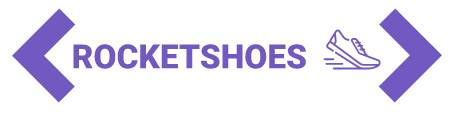

<!-- Logotipo -->
<div align="center">
  
</div>

<!-- Title -->
<h1 align="center"> Rocketseat 🔥 Ignite ReactJS </h1>

<!-- Logo -->
<div align="center">
  
</div>
<br/>
<br/>
<!-- Preview -->
<div align="center">
  
</div>

<!-- Sobre o Projeto -->
## 🧐 Sobre o Projeto
Rocketshoes é um projeto de carrinho de compras, desenvolvido em ReactJS para estudar hooks.

O principal objetivo é criar um hook de carrinho de compras. Segue as funcionalidades para esse desafio:
- Adicionar um novo produto ao carrinho;
- Remover um produto do carrinho;
- Alterar a quantidade de um produto no carrinho;
- Cálculo dos preços sub-total e total do carrinho;
- Validação de estoque;
- Exibição de mensagens de erro;
- Entre outros.

## 🚀 Tecnologias e Bibliotecas
* [ReactJS](https://reactjs.org/)
* [Redux](https://redux.js.org/)
* [Redux-Saga](https://redux-saga.js.org/)
* [React Router v4](https://github.com/ReactTraining/react-router)
* [Axios](https://github.com/axios/axios)
* [History](https://www.npmjs.com/package/history)
* [Immer](https://github.com/immerjs/immer)
* [Polished](https://polished.js.org/)
* [React-Toastify](https://fkhadra.github.io/react-toastify/)
* [styled-components](https://www.styled-components.com/)
* [React-Icons](https://react-icons.netlify.com/)
* [react-loading-skeleton](https://github.com/dvtng/react-loading-skeleton)
* [react-loader-spinner](https://github.com/mhnpd/react-loader-spinner)
* [json-server](https://github.com/typicode/json-server)
* [Reactotron](https://infinite.red/reactotron)

## 💻 Rodando o Projeto
```bash
# Realize o Clone deste repositório
$ git clone https://github.com/lucasbarque/Rocketshoes.git
# ou use a opção de download.
# Acesse a pasta dtmoney
$ cd Rocketshoes
# Instale as dependências
$ yarn install
ou
$ npm install
# Executando o Projeto
$ yarn start 
ou
$ npm start
# Acesse http://localhost:3000 no seu navagador
```
© 2022 GitHub, Inc.
Terms
Privacy
Security
Stat